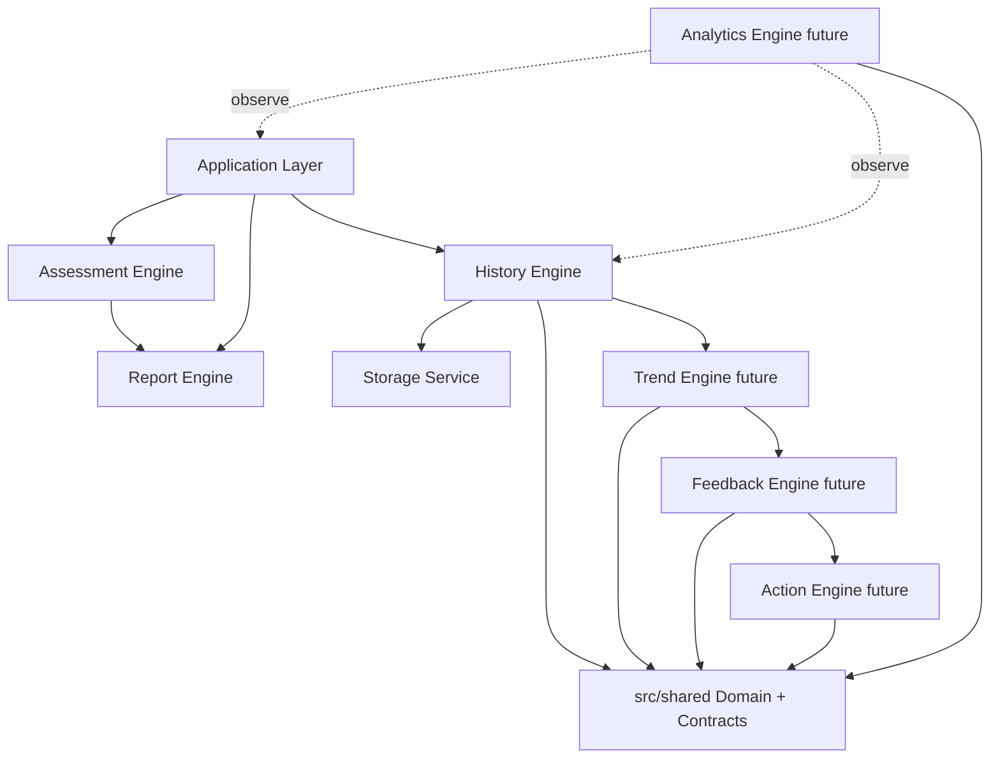

# Maiyaar Domain Model and Engine Contracts

Architecture sprint defining the canonical domain language shared by all Maiyaar engines. **No engine behaviour is implemented in this sprint.** Application runtime behaviour is unchanged.

## Purpose

Before Trend, Feedback, Action, or Analytics engines are built, Maiyaar requires:

1. A **shared domain model** (`src/shared/domain/`)
2. **Engine contracts** (`src/shared/contracts/`)
3. A **standard result/error model** (`src/shared/errors/`)
4. A **versioning strategy** (`src/shared/versioning/`)

Assessment and Report engines remain independent producers. History persists immutable snapshots. Downstream engines consume snapshots read-only.

---

## Domain model

Location: [`src/shared/domain/models.js`](../src/shared/domain/models.js)

| Model | Role |
|-------|------|
| `ContentVersion` | Questionnaire/content release identifier |
| `SectionResult` | Canonical section score (`sectionId`, `title`, `percentage`, `level`) |
| `OverallResult` | Overall score (`percentage`, `level`) |
| `AssessmentSnapshot` | Immutable History Engine record (matches existing snapshot format) |
| `HistoryEntry` | Snapshot + list metadata (`assessmentNumber`, `hasStoredReport`) |
| `TrendInput` / `TrendResult` | Trend Engine I/O (future) |
| `FeedbackInput` / `FeedbackResult` | Feedback Engine I/O (future) |
| `ActionPlanInput` / `ActionPlanResult` | Action Engine I/O (future) |
| `AnalyticsEvent` | Consent-gated telemetry envelope (future) |
| `UserPreferences` | Future consent and locale flags |

### AssessmentSnapshot (canonical — do not break)

Aligned with the existing History Engine persistence format:

```javascript
{
  schemaVersion: 1,
  snapshotId: "uuid",
  createdAt: "ISO-8601",
  appVersion: "1.0.1",
  contentVersion: "1.0",
  overallPercentage: 72.5,
  overallLevel: "Good",
  sectionSummary: [ SectionResult, ... ],
  reportSummary: { overallSummary, strongestSection, growthSection, actionPlanCount }
}
```

Validators: `isAssessmentSnapshot()`, `isSectionResult()`, `isHistoryEntry()` — shape checks only, no business logic.

---

## Engine contracts

Location: [`src/shared/contracts/`](../src/shared/contracts/)

Each contract exports a frozen descriptor: responsibilities, inputs, outputs, allowed/forbidden dependencies, data ownership.

### History Engine (implemented)

- **Inputs:** report at completion, `{ appVersion, contentVersion }`
- **Outputs:** `AssessmentSnapshot`, stored report map
- **Depends on:** Storage Service, Report helpers at write time
- **Forbidden:** Firebase writes, downstream engines, recalculation, direct localStorage

### Trend Engine (future)

- **Inputs:** `TrendInput { snapshots[] }`
- **Outputs:** `DomainResult<TrendResult>`
- **Depends on:** History snapshots (read-only)
- **Forbidden:** Assessment/Report recalculation, snapshot mutation

### Feedback Engine (future)

- **Inputs:** `FeedbackInput { snapshot, trend? }`
- **Outputs:** `DomainResult<FeedbackResult>`
- **Depends on:** History, optional Trend output
- **Forbidden:** Content/scoring changes, History writes

### Action Engine (future)

- **Inputs:** `ActionPlanInput { snapshot, trend?, feedback? }`
- **Outputs:** `DomainResult<ActionPlanResult>`
- **Depends on:** History, optional Trend + Feedback outputs
- **Forbidden:** Live report regeneration for historical views

### Analytics Engine (future)

- **Inputs:** `AnalyticsEvent`
- **Outputs:** `DomainResult<{ accepted }>`
- **Observes only** — never mutates Assessment, Report, History, Trend, Feedback, or Action data
- **Forbidden:** Raw answer values in metadata by default

---

## Dependency diagram



**Rule:** `History → Trend → Feedback → Action`. Analytics observes laterally.

---

## Data ownership

| Domain | Owner | Readers |
|--------|-------|---------|
| Questionnaire content | `questionnaire.json` | Assessment (read-only) |
| Live answers / session | Application + Storage | Assessment, Report at completion |
| Live report | Storage (`mahasaba-nafs-report`) | Presentation |
| Snapshots | History Engine | Trend, Feedback, Action (read-only) |
| Frozen historical reports | History Engine / Storage | Presentation (view only) |
| Trend/Feedback/Action outputs | Respective engines (future) | Presentation |
| Analytics events | Analytics Engine (future) | External sink (future, consent-gated) |

---

## Versioning strategy

Location: [`src/shared/versioning/snapshot-versioning.js`](../src/shared/versioning/snapshot-versioning.js)

Three independent version axes on every snapshot:

| Field | Meaning |
|-------|---------|
| `schemaVersion` | Snapshot **structure** version (migration trigger) |
| `appVersion` | Application release at completion |
| `contentVersion` | Questionnaire/content release at completion |

### Compatibility rules

1. **Additive changes** within the same `schemaVersion` — add optional fields only.
2. **Breaking changes** — increment `schemaVersion` and register a migration in `SNAPSHOT_MIGRATION_REGISTRY`.
3. **Tolerant reading** — consumers ignore unknown fields.
4. **Immutable snapshots** — no in-place edits after write.
5. **Downstream engines** never bump snapshot schema; only History write path migrates on read if needed.

Supported snapshot versions today: `[1]` (`HISTORY_SNAPSHOT_SCHEMA_VERSION`).

---

## Error / result model

Location: [`src/shared/errors/domain-result.js`](../src/shared/errors/domain-result.js)

Standard codes:

| Code | Use |
|------|-----|
| `Success` | Operation completed |
| `ValidationError` | Invalid input shape |
| `StorageError` | Persistence failure |
| `MigrationRequired` | Snapshot schema unsupported but migratable |
| `UnsupportedVersion` | Snapshot schema unsupported |
| `NotFound` | Missing snapshot or report |
| `NotEnabled` | Feature flag off |

Pattern:

```javascript
/** @type {import("../errors/domain-result.js").DomainResult<TrendResult>} */
const result = createSuccess(trendResult);
// or
const failure = createFailure("ValidationError", "snapshots array required");
```

Helpers: `createSuccess()`, `createFailure()`, `isDomainSuccess()`, `isDomainFailure()`.

---

## Migration guidance

### When to migrate

- Increment `schemaVersion` when removing/renaming required fields or changing field types.
- Do **not** migrate for new optional fields at the same schema version.

### Migration workflow (future sprint)

1. Read raw snapshot from Storage.
2. `isSupportedSnapshotVersion()` → if false, check `SNAPSHOT_MIGRATION_REGISTRY`.
3. Apply registered migrator chain to latest supported version.
4. Write migrated snapshot only through History Engine API.
5. Return `MigrationRequired` / `UnsupportedVersion` via `DomainResult` if migration cannot proceed.

### Firestore sync (future)

- Upload **post-migration** canonical `AssessmentSnapshot` shape only.
- Keep `schemaVersion`, `appVersion`, `contentVersion` on every remote document.
- Never sync raw answers unless explicit consent and rules review.

---

## Risks

| Risk | Mitigation |
|------|------------|
| Contract drift from implementation | History contract mirrors `history-engine.js`; snapshot validator matches persisted shape |
| Engines bypass Storage | Contracts forbid direct localStorage |
| Analytics exfiltration | `ANALYTICS_EVENT_TYPES` + contract forbids answer payload |
| Breaking snapshot changes | `schemaVersion` + migration registry before rollout |
| Circular engine dependencies | Enforced order History → Trend → Feedback → Action |

---

## Protected assets (this sprint)

| Asset | Status |
|-------|--------|
| `questionnaire.json` | Unchanged |
| Scoring / assessment / report logic | Unchanged |
| History snapshot format | Documented, not modified |
| Application behaviour | Unchanged (no imports wired yet) |

---

## File index

```
src/shared/
  index.js
  feature-flags.js
  domain/
    models.js
    index.js
  errors/
    domain-result.js
    index.js
  versioning/
    snapshot-versioning.js
    index.js
  contracts/
    history-engine.contract.js
    trend-engine.contract.js
    feedback-engine.contract.js
    action-engine.contract.js
    analytics-engine.contract.js
    index.js
```
