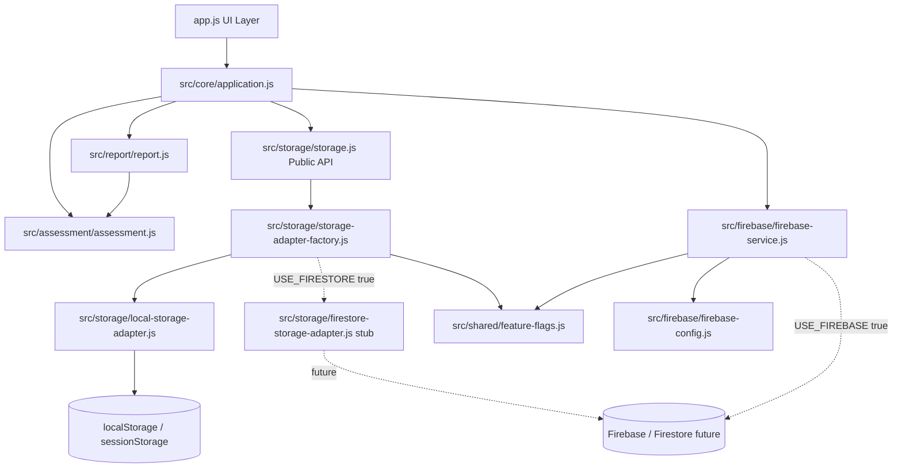

# Version 2 Sprint 2 — Firebase Infrastructure

This document describes the optional Firebase layer introduced in Sprint 2. **Default behaviour remains local-only.** No Firestore writes, migrations, or analytics are enabled in this sprint.

## Architecture



## Feature flags

| Flag | Default | Purpose |
|------|---------|---------|
| `USE_FIREBASE` | `false` | Load Firebase SDK and initialize app |
| `USE_FIRESTORE` | `false` | Select Firestore storage adapter (not active in Sprint 2) |

Location: `src/shared/feature-flags.js`

When both flags are `false` (default):

- Firebase SDK is **not** loaded
- Storage resolves to `LocalStorageAdapter`
- Application behaviour is identical to Sprint 1B

## Firebase configuration

Location: `src/firebase/firebase-config.js`

Configuration uses placeholder values (`REPLACE_WITH_*`) until a Firebase project is provisioned. Initialization is skipped when:

- `USE_FIREBASE` is `false`, or
- configuration is incomplete

Firebase modules are **not** imported by Assessment, Report, or Storage public API consumers.

## Firestore schema (design only)

No collections are written in Sprint 2. Schemas are lightweight and version-tagged for future sync.

### Collection: `assessments`

Purpose: Completed assessment snapshots (future cloud history).

| Field | Type | Notes |
|-------|------|-------|
| `assessmentId` | string | Document ID (UUID) |
| `anonymousUserId` | string | Reference to `anonymousUsers` |
| `createdAt` | timestamp | Server timestamp on write |
| `appVersion` | string | e.g. `1.0.1` |
| `contentVersion` | string | From questionnaire metadata when available |
| `overallPercentage` | number | Denormalized for queries |
| `overallLevel` | string | English level key |
| `sectionSummary` | array | `{ sectionId, title, percentage, level }` |
| `reportPayload` | map | Full report object (future; subject to privacy review) |

Indexes (future): `anonymousUserId + createdAt desc`

### Collection: `anonymousUsers`

Purpose: Pseudonymous device/session identity before optional auth.

| Field | Type | Notes |
|-------|------|-------|
| `anonymousUserId` | string | Document ID |
| `createdAt` | timestamp | First seen |
| `lastSeenAt` | timestamp | Updated on activity |
| `clientInstanceId` | string | Random UUID in client storage |
| `consentFlags` | map | `{ analytics: false, cloudSync: false }` |

### Collection: `events`

Purpose: Consent-gated telemetry (future Analytics Engine).

| Field | Type | Notes |
|-------|------|-------|
| `eventId` | string | Document ID |
| `anonymousUserId` | string | Optional link |
| `eventType` | string | e.g. `session_start`, `assessment_complete` |
| `occurredAt` | timestamp | Event time |
| `appVersion` | string | Client version |
| `metadata` | map | **No answer values by default** |

### Collection: `appConfig`

Purpose: Remote feature flags and minimum version (future).

| Field | Type | Notes |
|-------|------|-------|
| `configId` | string | e.g. `production` |
| `minAppVersion` | string | Force-upgrade threshold |
| `featureFlags` | map | Remote overrides (future) |
| `updatedAt` | timestamp | Last publish |

Document ID for singleton config: `production`

## Storage adapter design

### Public API (unchanged)

`src/storage/storage.js` continues to export:

- `STORAGE_KEYS`
- `saveAnswers`, `loadAnswers`
- `saveSession`, `loadSession`
- `saveReport`, `loadReport`
- `clearAll`, `hasIncompleteSession`
- `StorageService`

### Adapter resolution

```
StorageService (storage.js)
    ↓
resolveStorageAdapter() (storage-adapter-factory.js)
    ↓
USE_FIRESTORE === false → LocalStorageAdapter (active)
USE_FIRESTORE === true  → FirestoreStorageAdapter (stub; throws if called)
```

### Adapter contract

Defined in `src/storage/storage-adapter-interface.js`. All adapters must implement the same method signatures as the current local implementation.

## Security considerations (future enablement)

1. **Firestore rules** — Users read/write only their own documents; deny by default.
2. **No open collections** — Reject unauthenticated broad writes.
3. **Pseudonymity** — Use `anonymousUsers.clientInstanceId`; avoid PII in assessment payloads until policy approved.
4. **Answer content** — Do not sync raw answers to `events`; full `reportPayload` requires explicit consent and rules review.
5. **Config secrets** — Firebase web API keys are public by design; restrict via App Check and Firestore rules, not key hiding.
6. **Placeholder config** — Incomplete config prevents initialization; app falls back to local-only.
7. **Adapter stub** — Firestore adapter throws if enabled before implementation; prevents silent partial migration.

## Sprint 2 scope boundary

| In scope | Out of scope |
|----------|--------------|
| Firebase config isolation | Firestore writes |
| Optional SDK initialization | Data migration |
| Storage adapter abstraction | Analytics dashboards |
| Feature flags (default off) | History / Trend / Feedback / Action engines |
| Schema documentation | Admin dashboard |

## Manual verification

1. Load app with default flags — behaviour identical to Sprint 1B.
2. DevTools Network — no requests to `firebaseio.com` or `googleapis.com/firestore` on load.
3. Complete assessment — localStorage keys unchanged.
4. Refresh — resume and report restore work.
5. Console — no Firebase errors with default flags.
6. (Optional) Set `USE_FIREBASE: true` with incomplete config — warning logged; app continues locally.
7. (Optional) Set `USE_FIRESTORE: true` — adapter stub selected; **do not use in production** until adapter is implemented.

## Protected assets

| Asset | Sprint 2 status |
|-------|-----------------|
| `questionnaire.json` | Unchanged |
| Scoring methodology | Unchanged |
| Assessment methodology | Unchanged |
| Report calculations | Unchanged |
| Storage keys / JSON formats | Unchanged |
| UI / CSS / navigation / printing | Unchanged |
